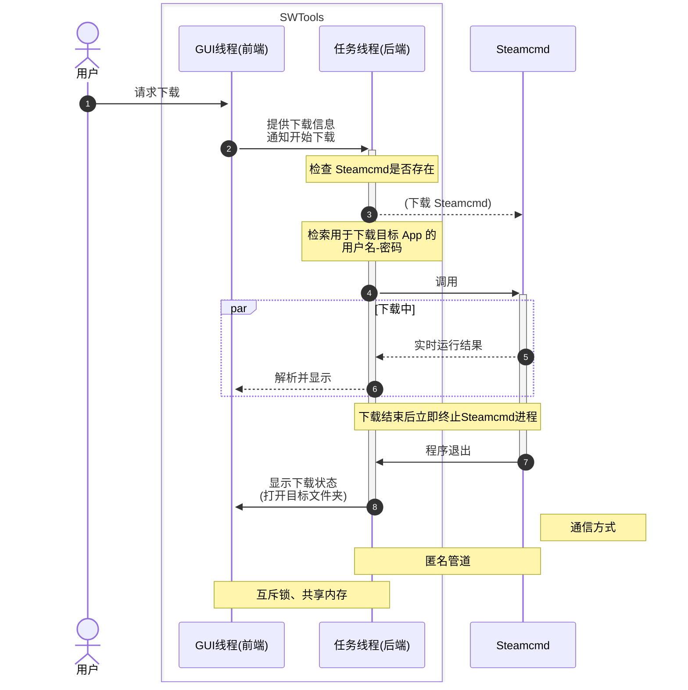

# 贡献指南

欢迎为本项目贡献一份力量！

下面介绍项目的实现方式，你可以选择一个擅长或者感兴趣的部分开发。

## 程序逻辑

- GUI 采用的技术是 **MFC**（Visual C/C++）。
- 后端相关代码全部放在 `backend/` 下（声明和实现不分离）；下载一律用的是 `curl`。下面是部分文件的介绍：
  - `backend.hpp`：这是总头文件；
  - `app_info.hpp`：这里存储了用于登录不同 Steam App 的 *用户名-密码* 对信息；
  - `downloader.hpp`：这里是主下载逻辑；
  - `process.hpp`：这是一个包装器，用于调用 Steamcmd；
