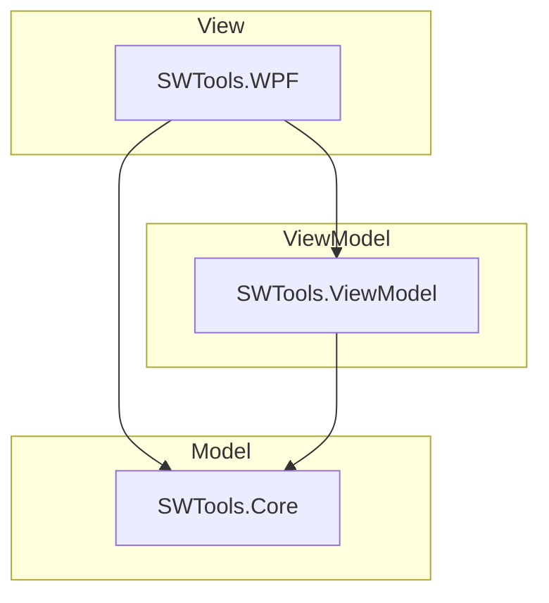

# 架构设计

本文档介绍项目的技术结构设计和测试事宜。

## 架构总览

本项目依照 MVVM（Model-ViewModel-View）架构设计。解决方案一共有三个子项目：



上图中箭头表示子项目之间的引用关系。

- **SWTools.WPF**

  > 生成类型：Windows 应用程序

  负责实现前端，即 “View” 部分，包含少量交互逻辑代码。前端使用的技术是 WPF（.NET）。应该把复杂的交互逻辑放在 SWTools.ViewModel 中实现，然后由 SWTools.WPF 调用。

- **SWTools.ViewModel**

  > 生成类型：类库

  实现交互逻辑，构建前端和后端的桥梁，为前端 XAML 提供绑定。除了一些简单的窗口，每个 SWTools.WPF 中的窗口在这里都有对应的 ViewModel。这些对应的 ViewModel 作为窗口的 DataContext 使用。


- **SWTools.Core** 

  > 生成类型：类库

  这是核心代码，即 “Model” 部分，是程序的后端。

## 托管 API

```
api/
├── latest_info    # 仓库的最新版本
└── pub_accounts   # 公有账户池
```

以上 API 托管在 Github 上，可被运行中的程序拉取。

## SWTools.WPF

```
SWTools.WPF/
├── Controls/    # 自定义的控件（如 IconButton）
├── Resources/   # 程序用到的资源（如图标）
|
├── App.xaml             # 定义一些程序通用资源，如画刷
|   └── App.xaml.cs      # 程序入口点，执行初始化操作
|
| # 以下省略 .xaml.cs，它们都是配套 .xaml 的窗口逻辑。
|
├── MainWindow.xaml      # 主窗口
├── AddTaskWindow.xaml   # 添加任务窗口
├── MoreWindow.xaml      # "更多" 窗口
├── LogWindow.xaml       # 日志窗口
|
└── MsgBox.xaml          # 自定义的对话框窗口
```

注意事项：

- 设计新元素时，优先考虑重用 `App.xaml` 中定义的画刷。
- 需要对话框时，优先考虑使用自定义的 `MsgBox`。
- 简单的窗口逻辑在 `.xaml.cs` 中写；复杂的逻辑要抽离到 SWTools.ViewModel 中，保持前端代码简洁。

## SWTools.ViewModel

```
SWTools.ViewModel/
├── DisplayItem.cs    # 用来展示的创意工坊物品
├── Helper.cs         # 辅助方法
|
└── # 剩余的文件都是搭配 SWTools.WPF 中相同名称的窗口使用的 ViewModel
```

- 相比 Item，DisplayItem 更注重展示，其有一些方便前端窗口绑定的属性。

## SWTools.Core

```
SWTools.Core/
|
| # 以下每个子文件夹使用一个同名子命名空间
├── API/    # 和内部或外部 API 交互
|   ├── LastInfo.cs        # 仓库最新信息 api/latest_info
|   ├── PubAccounts.cs     # 公有账户池 api/pub_accounts
|   └── SwDownloader.cs    # steamworkshopdownloader.io/api
|
├── Cache/  # 缓存机制
|   └── Parse.cs           # 全局解析缓存
|
├── Helper/ # 辅助方法
|   ├── Main.cs            # 辅助方法 (主要)
|   ├── Http.cs            # 辅助方法 (Http)
|   └── Steamcmd.cs        # 辅助方法 (Steamcmd)
| #
|
├── Item/  # 创意工坊物品
|   ├── Item.Core.cs       # 创意工坊物品 (核心逻辑)
|   └── Item.cs            # 创意工坊物品
|
├── ItemList               # 创意工坊物品物品列表 (容器)
|
├── Account.cs             # (用于下载的) Steam 账户
├── AccountManager.cs      # Steam 账户管理器 (静态类)
|
├── Config.cs              # 可自定义的配置
├── ConfigManager.cs       # 配置管理器 (静态类)
|
├── Constants.cs           # 包含了目录、URL、Helper 里面的常量
├── LicenseManager.cs      # 许可证文本 (静态类)
├── LogManager.cs          # 日志管理器 (静态类)
|
└── Programe.cs            # 测试用入口点
```
> [!NOTE]
>
> 以 `Manager` 结尾的几个设计，未来可能使用依赖注入重构。（即抛弃 `Maneger` 的设计）
>
> 仍在斟酌中。


- 要使用日志器，请用 `LogManager.Log`（无论在哪个子项目）。例如：

  ```csharp
  LogManager.Log.Information("Hello, world");
  ```

- 要访问程序的配置，请用 `ConfigManeger.Config`。

## 单元测试

正如架构总览中提到的，只有 SWTools.WPF 的生成类型是应用程序，其他都是类库；这意味着它们不能被运行。

要进行除 SWTools.WPF 外项目的单元测试，应该先修改其项目的生成类型为 “控制台应用程序”，再进行测试。发布前记得改回来。
